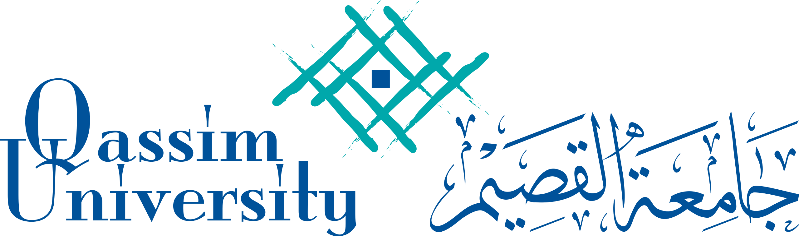

# Qassim University OpenData _(small website)_

#### This website, was created as a requirement to finish the Summer Training in QUIT.

##### This website was created by:

* [Laravel Framework,](https://laravel.com/docs/10.x)
* [Tailwind for CSS,] (https://tailwindcss.com/)
* [Alpine for JS.] (https://alpinejs.dev/start-here)

#### Quickstart

1. [ ] clone this repo locally
2. [ ] run `npm install & npm run dev`
3. [ ] run `php artisan serve`
4. [ ] run `php artisan migrate:freesh --seed`
5. [ ] for admin experience, login using `admin@mail.com & 12345678`

### Website demo

#### Guest Pages:

* Home Page
* Dataset show Page

#### Admin Pages:

* Datasets Page
*
    * show
*
    * edit
*
    * create
* Tags Page
*
    * edit
*
    * create
* Users Page
